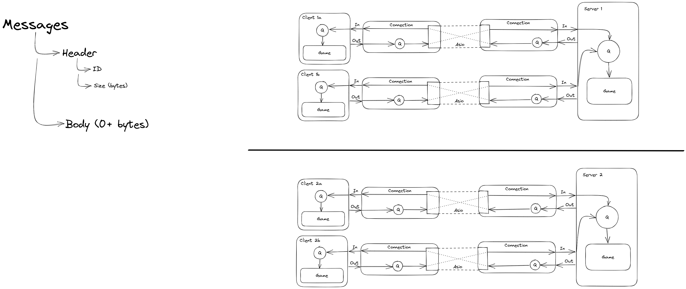
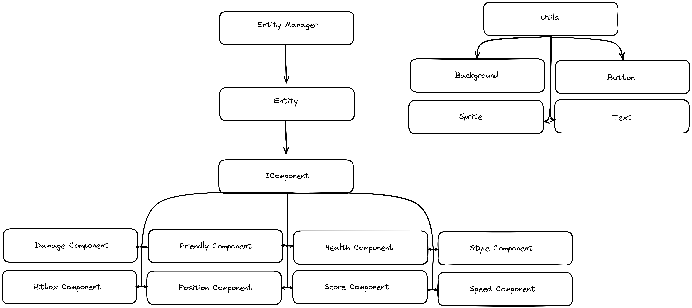

<div id="top"></div>
<br />
<div align="center">
  <a href="https://github.com/EpitechPromo2025/B-CPP-500-PAR-5-2-rtype-martin.leblancs">
    
  </a>

<h3 align="center">R-TYPE</h3>

  <p align="center">
    A game engine that roars!
    <br />
  </p>
</div>
<details>
  <summary>Table of Contents</summary>
  <ol>
    <li>
      <a href="#about-the-project">About The Project</a>
      <ul>
        <li><a href="#built-with">Built With</a></li>
        <li><a href="#our-group">Our group</a></li>
        <li><a href="#commits-norm">Commits norm</a></li>
      </ul>
    </li>
    <li>
      <a href="#getting-started">Getting Started</a>
      <ul>
        <li><a href="#documentation">Documentation</a></li>
        <li><a href="#prerequisites">Prerequisites</a></li>
        <li><a href="#installation">Installation</a></li>
      </ul>
    </li>
    <li><a href="#usage">Usage</a></li>
  </ol>
</details>

# About The Project

<div align="center">
    
</div>

This project of the Advanced C++ knowledge unit will introduce you to networked video game development, while giving you opportunity to explore in-depth advanced development topics as well as to learn
good software engineering practices.

### Built using:

* [C++](https://en.cppreference.com/w/)
* [CMake](https://cmake.org/)
* [Asio](https://think-async.com/Asio/)
* [raylib](https://www.raylib.com/)

# Getting Started

Your goal: implement a multithreaded server and a graphical client for a game called R-Type, using an engine of your own design.

First, you will develop the core architecture of the game and deliver a working prototype, and in a second
time, you will expand several aspects the prototype toward new horizons, exploring specialized areas of
your choice from a list of proposed possibilities.

# Documentation

In this directory you have access to documentation explaining things to know about this program.

### How our Network protocol is working



### How our Game Engine is working



# Prerequisites

* [Conan(Version 1.59.0)](https://conan.io)
* [CMake](https://cmake.org)

```sh
    - pip install conan==1.59.0
```

# Installation

Clone the repo
   ```sh
   - git clone git@github.com:EpitechPromo2025/B-CPP-500-PAR-5-2-rtype-martin.leblancs.git
   ```

# Usage

  On LINUX
  ```sh
  ./compile_linux.sh
  ./bin/r-type_server [PORT]
  ./bin/r-type_client [IP] [PORT]
  ```
   On WINDOWS
  ```sh
  ./compile_windows.sh
  ./bin/r-type_server.exe [PORT]
  ./bin/r-type_client.exe [IP] [PORT]
  ```


# Commit norm

When adding something:
```sh
[ADD] Adding this
   ```
When fixing something:
```sh
[FIX] Fixing this
   ```
When deleting something:
```sh
[DEL] Deleting this
   ```

# Our group
| Name | GitHub |
| ------ | ------ |
| Martin Leblancs | [MartinLeblancs][GhML] |
| Tom Fuller | [TomDuCoin][GhTF] |
| Matthieu Queru | [Matthieu33197][GhMQ] |
| Noe Moyen | [NoeMoyen][GhNM] |
| Noel Varga | [noelvarga25][GhNV] |


[//]: # (These are the links used above)

   [GhML]: <https://github.com/MartinLeblancs>
   [GhTF]: <https://github.com/TomDuCoin>
   [GhMQ]: <https://github.com/Matthieu33197>
   [GhNM]: <https://github.com/NoeMoyen>
   [GhNV]: <https://github.com/noelvarga25>

<p align="right">(<a href="#top">back to top</a>)</p>
